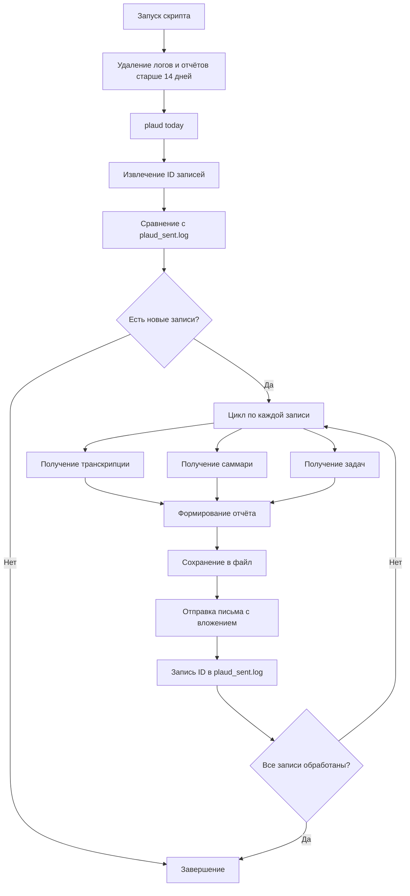

# Plaud Reports

[](https://github.com/surikat858/plaud-reports/releases)
[](https://github.com/PowerShell/PowerShell)
[](https://opensource.org/licenses/MIT)
[](https://www.microsoft.com/windows)
[](https://plaud.ai)

---

## 📌 О проекте

**Plaud Reports** – это набор PowerShell-скриптов для автоматического получения расшифровок, саммари и списка задач из записей [Plaud](https://plaud.ai) и отправки их на почту.

Решение предназначено для пользователей Windows, которые хотят автоматизировать процесс обработки встреч и отправки отчётов без ручного участия.

**Автор:** [surikat858](https://github.com/surikat858)

---

## 📖 Оглавление

- [О проекте](#-о-проекте)
- [Что сделано](#-что-сделано)
- [Как работает (схема)](#-как-работает-схема)
- [Требования](#-требования)
- [Установка и настройка](#-установка-и-настройка)
- [Использование](#-использование)
- [Структура файлов и папок](#-структура-файлов-и-папок)
- [Тестирование](#-тестирование)
- [Сборка EXE](#-сборка-exe)
- [Часто задаваемые вопросы (FAQ)](#-часто-задаваемые-вопросы-faq)
- [Дальнейшее развитие](#-дальнейшее-развитие)
- [Вклад в проект](#-вклад-в-проект)
- [Лицензия](#-лицензия)
- [Контакты](#-контакты)

---

## 🚀 Что сделано

| Функция | Описание |
|---------|----------|
| **Два варианта скрипта** | Интерактивный (с выводом в консоль) и для Планировщика (без пауз) |
| **Несколько получателей** | Отправка на любое количество email-адресов |
| **Подробное логирование** | Ежедневные логи в папке `PlaudReports` |
| **Автоматическая ротация** | Удаление логов и отчётов старше 14 дней |
| **Кириллица** | Полная поддержка русского языка (UTF-8 с BOM) |
| **Умная отправка** | Отправляются только новые записи (не дублируются) |
| **Прогресс** | Отображение хода выполнения в интерактивном режиме |
| **Безопасность** | Использование паролей приложений для SMTP |

---

## 🔧 Как работает (схема)



---

## 📦 Требования

| Компонент | Версия / Команда |
|---|---|
| Операционная система | Windows 10 / 11 |
| PowerShell | 5.1 или выше |
| Node.js | 14.x или выше |
| Plaud CLI | `npm install -g @plaud-ai/cli` |
| Авторизация Plaud | `plaud login` |
| SMTP-аккаунт | Логин и пароль приложения |

---

## ⚙️ Установка и настройка

### 1️⃣ Клонирование репозитория

```bash
git clone https://github.com/surikat858/plaud-reports.git
cd plaud-reports
```

Или скачайте ZIP-архив и распакуйте в любую папку.

### 2️⃣ Установка Plaud CLI

```powershell
# Установка Plaud CLI через npm
npm install -g @plaud-ai/cli

# Авторизация в Plaud (откроется браузер)
plaud login
```

### 3️⃣ Настройка скрипта

Откройте файл `send-plaud-report.ps1` или `send-plaud-report-scheduled.ps1` в любом текстовом редакторе.

Найдите блок КОНФИГУРАЦИЯ и замените значения:

```powershell
# ============================================================
# 🔐 КОНФИГУРАЦИЯ (ЗАМЕНИТЕ НА СВОИ ДАННЫЕ)
# ============================================================
$smtpServer = "smtp.your-provider.com"          # SMTP-сервер
$smtpPort = 587                                 # Порт (587 или 465)
$username = "your-email@example.com"            # Логин (полный email)
$password = "your-app-password"                 # Пароль приложения
$from = "sender@example.com"                    # Адрес отправителя

# Список получателей (можно один или несколько)
$recipients = @(
    "recipient1@example.com",
    "recipient2@example.com"
)
```

> ⚠️ **ВАЖНО:** Используйте пароль приложения, а не основной пароль от почтового ящика. Это повышает безопасность.

### 4️⃣ Разрешение выполнения скриптов

Выполните один раз в PowerShell (от имени администратора):

```powershell
Set-ExecutionPolicy RemoteSigned -Scope CurrentUser
```

### 5️⃣ Настройка SMTP

Для популярных почтовых сервисов:

| Сервис | SMTP-сервер | Порт | SSL/TLS |
|---|---|---|---|
| Gmail | smtp.gmail.com | 587 | STARTTLS |
| Yandex | smtp.yandex.ru | 587 | STARTTLS |
| Mail.ru | smtp.mail.ru | 587 | STARTTLS |
| Outlook/Hotmail | smtp-mail.outlook.com | 587 | STARTTLS |
| Reg.ru хостинг | mail.hosting.reg.ru | 587 | STARTTLS |

Для Gmail: включите "Доступ для ненадёжных приложений" или создайте пароль приложения в настройках аккаунта.

---

## 🚀 Использование

### Ручной запуск

```powershell
# Перейдите в папку со скриптом
cd C:\путь\к\plaud-reports

# Запустите интерактивный скрипт
.\send-plaud-report.ps1
```

Что вы увидите:

```text
==================================================
  📧 PLAUD ОТЧЁТ
==================================================

Найдено новых записей: 2

Обработка [1/2]: a1b2c3d4...
  Получение транскрипции... ✅
  Получение саммари... ✅
  Получение задач... ✅
  Сохранение файла... ✅
  Отправка письма... ✅

Обработка [2/2]: e5f6g7h8...
  Получение транскрипции... ✅
  Получение саммари... ✅
  Получение задач... ✅
  Сохранение файла... ✅
  Отправка письма... ✅

==================================================
  📊 ИТОГИ
==================================================
✅ Обработано: 2
✅ Ошибок: 0

📁 Лог сохранён в: C:\Users\...\PlaudReports\plaud_log_2026-08-31.txt
==================================================
```

### Автоматический запуск (Планировщик)

1. Откройте Планировщик заданий:
   - Нажмите `Win + R`
   - Введите `taskschd.msc`
   - Нажмите Enter

2. Создайте новую задачу:
   - Нажмите "Создать задачу" (справа)

3. Вкладка "Общие":
   - Имя: `Plaud Reports`
   - ✅ "Выполнять независимо от того, зарегистрирован ли пользователь"
   - ✅ "Скрыть"
   - Настроить для: Windows 10

4. Вкладка "Триггеры" → Создать:
   - Начать задачу: По расписанию
   - Повторять каждые: 1 час
   - Продолжительность: Бесконечно

5. Вкладка "Действия" → Создать:
   - Действие: Запуск программы
   - Программа/сценарий: `powershell.exe`
   - Аргументы:

     ```text
     -WindowStyle Hidden -ExecutionPolicy Bypass -File "C:\путь\к\plaud-reports\send-plaud-report-scheduled.ps1"
     ```

6. Нажмите ОК и введите пароль учётной записи.

---

## 📁 Структура файлов и папок

```text
plaud-reports/
├── README.md                                    # Документация
├── LICENSE                                      # Лицензия MIT
├── send-plaud-report.ps1                        # Интерактивный скрипт
├── send-plaud-report-scheduled.ps1              # Скрипт для планировщика
├── .gitignore                                    # Игнорируемые файлы
└── docs/
    └── images/                                   # Скриншоты (опционально)

%USERPROFILE%\Documents\PlaudReports\
├── plaud_log_2026-08-31.txt                     # Лог работы за день
├── plaud_sent.log                               # ID отправленных записей
├── 20260831_120000_a1b2c3d4e5f6.txt             # Отчёт 1
└── 20260831_130000_e5f6g7h8i9j0.txt             # Отчёт 2
```

---

## 🧪 Тестирование

Чтобы убедиться, что всё работает:

1. Создайте тестовую запись в приложении Plaud (телефон или компьютер).
2. Дождитесь обработки (1-2 минуты).
3. Запустите скрипт вручную:

   ```powershell
   .\send-plaud-report.ps1
   ```

4. Проверьте результаты:
   - ✅ Новый файл появился в `PlaudReports`
   - ✅ Письмо пришло на все указанные адреса
   - ✅ ID записи добавлен в `plaud_sent.log`

5. Запустите скрипт повторно — он должен сообщить, что все записи уже отправлены.

---

## 📦 Сборка EXE

### Способ 1: PS2EXE (рекомендуется)

Установите модуль:

```powershell
Install-Module -Name PS2EXE -Scope CurrentUser
```

Создайте EXE:

```powershell
# Для интерактивной версии (с окном)
ps2exe -inputFile .\send-plaud-report.ps1 -outputFile .\PlaudReports.exe -title "Plaud Reports" -version "1.0.0"

# Для версии для планировщика (без окна)
ps2exe -inputFile .\send-plaud-report-scheduled.ps1 -outputFile .\PlaudReportsScheduled.exe -title "Plaud Reports (Scheduled)" -version "1.0.0" -noconsole
```

Готовые EXE-файлы появятся в текущей папке.

### Способ 2: PowerShell Pro Tools (платный)

1. Откройте PowerShell Pro Tools.
2. Выберите "Package" → "Windows Application".
3. Укажите путь к скрипту и настройте параметры.
4. Нажмите "Build".

> Важно: при создании EXE пути к файлам (`$env:USERPROFILE`) работают корректно, так как они разрешаются во время выполнения.

---

## ❓ Часто задаваемые вопросы (FAQ)

**1. Что делать, если скрипт не видит `plaud`?**

```powershell
# Проверьте установку
plaud --version

# Если не работает, переустановите:
npm uninstall -g @plaud-ai/cli
npm install -g @plaud-ai/cli
```

**2. Как обновить Plaud CLI до последней версии?**

```powershell
npm update -g @plaud-ai/cli
```

**3. Где найти пароль приложения для Gmail?**

Зайдите в Google Аккаунт → Безопасность → включите "Двухфакторную аутентификацию" → выберите "Пароли приложений" → создайте пароль для приложения (выберите "Другое" и назовите "Plaud").

**4. Скрипт запускается, но письма не приходят. Что делать?**

- Проверьте настройки SMTP (сервер, порт, логин, пароль).
- Убедитесь, что пароль приложения правильный.
- Проверьте папку "Спам" в почте.
- Посмотрите лог в `PlaudReports\plaud_log_*.txt`.

**5. Как удалить все отчёты вручную?**

```powershell
Remove-Item -Path "$env:USERPROFILE\Documents\PlaudReports\*.txt" -Force
```

**6. Можно ли изменить срок хранения файлов?**

Да, в скрипте найдите строку:

```powershell
$cutoffDate = (Get-Date).AddDays(-14)  # 14 дней
```

Измените число на нужное (например, `-30` для 30 дней).

**7. Почему в письмах кракозябры вместо текста?**

Убедитесь, что в скрипте установлена кодировка UTF-8:

```powershell
$mail.BodyEncoding = [System.Text.Encoding]::UTF8
$mail.SubjectEncoding = [System.Text.Encoding]::UTF8
```

Также при сохранении файла используется `UTF8Encoding $true` (с BOM).

**8. Можно ли запускать скрипт на нескольких компьютерах?**

Да, просто скопируйте папку со скриптами и настройте Plaud CLI (`plaud login`) и SMTP-параметры на каждом компьютере.

---

## 🔄 Дальнейшее развитие

| Идея | Описание | Приоритет |
|---|---|---|
| 📄 Конфигурационный файл | Вынести SMTP-настройки и получателей в JSON/XML | ⭐⭐⭐ |
| 📎 Форматы отчётов | Добавить PDF, DOCX, HTML, Markdown | ⭐⭐⭐ |
| 📱 Telegram / Slack | Отправка через ботов в мессенджеры | ⭐⭐ |
| 🌐 Веб-интерфейс | Локальный веб-сервер для просмотра отчётов | ⭐⭐ |
| 🧩 Несколько источников | Разные SMTP-аккаунты для разных получателей | ⭐⭐ |
| 🐳 Контейнеризация | Docker-образ для простого развёртывания | ⭐ |
| 📊 Статистика | Сбор метрик и формирование отчётов | ⭐⭐ |
| 🔄 Интеграция с CRM | Битрикс24, Salesforce, AmoCRM | ⭐ |
| 🔐 Шифрование пароля | Хранение пароля в защищённом виде | ⭐⭐⭐ |
| 📈 Графический интерфейс | WinForms или WPF для управления | ⭐ |

---

## 🤝 Вклад в проект

Если у вас есть идеи, предложения или вы нашли ошибку:

1. Создайте Issue с описанием проблемы.
2. Форкните репозиторий.
3. Внесите изменения и создайте Pull Request.

Все идеи и улучшения приветствуются!

---

## 📄 Лицензия

Проект распространяется под лицензией MIT.
Это означает, что вы можете свободно использовать, изменять и распространять код.

Подробнее: [LICENSE](LICENSE)

---

## 📬 Контакты

- **Автор:** [surikat858](https://github.com/surikat858)
- **Репозиторий:** [github.com/surikat858/plaud-reports](https://github.com/surikat858/plaud-reports)
- **По вопросам:** создавайте Issue в репозитории

### ⭐ Поддержка проекта

Если проект оказался полезным:

- Поставьте ⭐ на GitHub
- Расскажите о нём коллегам
- Сделайте форк и добавьте свои улучшения

---

🚀 Enjoy automated reporting with Plaud Reports!
